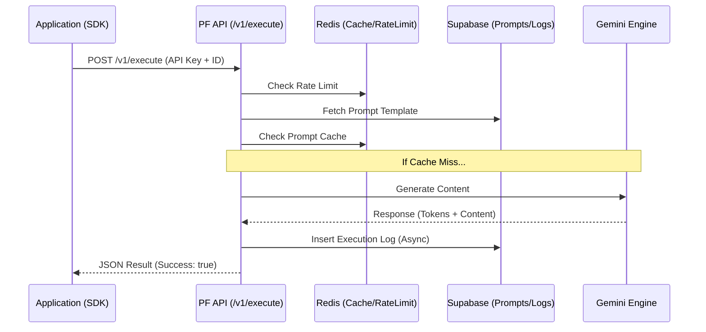

# PromptForge Architecture: SDK to Backend Flow

This document explains how a prompt travels from the **PromptForge SDK** in a client application to the **Backend API**, and eventually to the **AI Engine**.

---

## 1. The SDK Layer (`promptforge-sdk`)
When you call `sdk.execute({ versionId: "..." })` in your code:

- **Client Initialization**: The `PromptForgeClient` stores your `apiKey` and `baseUrl`.
- **Request Formation**: It wraps your `versionId` and `variables` into a POST request.
- **Header Injection**: It attaches your API Key to the `x-api-key` header.
- **Handling Results**: Once the API responds, it converts the backend's `snake_case` JSON (e.g., `latency_ms`) into clean `CamelCase` for your TypeScript code (`latencyMs`).

---

## 2. The API Gateway (`/api/v1/execute`)
This is the entry point for all programmatic prompt executions.

### A. Authentication & Defense
1. **API Key Validation**: The system checks if the key exists in the `v2_api_keys` table and if it's currently active.
2. **Rate Limiting**: It enforces a limit (currently 120 req/min) using a Redis-backed rate limiter to prevent abuse.
3. **Payload Validation**: Uses `Zod` to ensure the `version_id` is a valid UUID before doing any database work.

### B. Intelligent Retrieval
The API doesn't store the AI's response; it stores the **Prompt Template**. 
1. **V2 Search**: It looks for a saved prompt in `v2_prompt_versions` that matches the ID AND is owned by the workspace associated with your API Key.
2. **Published Lock**: It only allows execution of prompts marked as `published: true` to prevent accidental execution of draft code.
3. **V1 Fallback**: If not found in V2, it checks the legacy `prompts` table (Playground history) so your old prompt IDs don't break.

---

## 3. The AI Execution Engine
Once the template is retrieved:

### A. Variable Injection
The system takes the static template and replaces placeholders like `{{name}}` with the variables you provided in the SDK.

### B. Smart Caching (`lib/cache.ts`)
Before calling the expensive AI model, it generates a hash of:
`Prompt ID + System Instruction + Variables`
If this exact combination was run recently, it returns the **Cached Result** in < 50ms, saving you model costs and time.

### C. The Router (`lib/router.ts`)
If no cache is found:
- **Model Fallback**: It tries your preferred model (e.g., Gemini 3.1 Pro).
- **Auto-Switching**: If that model is busy (Capacity issue) or your specific API Key for that model is exhausted, it automatically tries the next best model (e.g., Gemini 1.5 Flash) until it succeeds.

---

## 4. Telemetry & Analytics
After the response is sent back to you:
- **Logging**: The system logs the execution to `v2_execution_logs`.
- **Metrics**: It records latency, token count (input/output), and the calculated USD cost.
- **Cost Tracking**: This data powers the "Usage & Costs" charts in your Dashboard.

---

## Visual Summary

