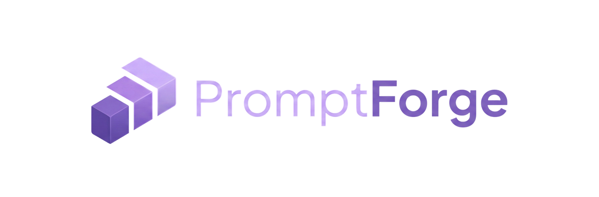

# Prompt Forge Studio

**Prompt Forge Studio** is a specialized middleware platform designed to bridge the gap between human intent and large language model (LLM) execution. It serves as an advanced development environment (ADE) for prompt engineering, allowing developers and prompt engineers to structure, refine, and optimize raw inputs into production-grade instructions.

The system leverages heuristic analysis and semantic understanding to detect ambiguity in natural language, automatically restructuring requests into high-fidelity prompts that improve model performance, consistency, and reduced latency.

## Key Features

### 🚀 Advanced Studio Environment
A dedicated, IDE-like workspace for crafting and iterating on prompts.
- **Cognitive Depth Control**: Switch between 'Short', 'Medium', 'Detailed', and 'Granular' modes to control query expansion.
- **Real-time Status**: Status indicators for Goal, Context, and Constraints injection.
- **Split-View Comparison**: A sidebar history to drag-and-drop previous versions.

### 🎮 Prompt Engineering Playground
A gamified learning environment to master prompt engineering skills through interactive challenges.
- **Fixer Mode**: Debug and repair broken prompts to achieve specific outcomes.
- **Builder Mode**: Learn to construct prompts from scratch using industry-standard templates.
- **Battle Mode**: Compete against AI to predict which prompt yields better results.
- **Precision Mode**: Hone your ability to write constraint-heavy prompts with perfect accuracy.

### 🏆 Gamification & Progression
- **Badge System**: Earn over 15 unique badges (Common to Legendary) for your achievements.
- **XP & Levels**: Gain experience points for every challenge completed.
- **Public Profile**: Showcase your earned badges and levels on your profile.

### 🧪 A/B Testing Laboratory (Benchmark)
Compare two prompt variations side-by-side to analyze structural differences and predicted performance.
- **Visual Diffing**: Clean split-view layout to spot differences instantly.
- **Heuristic Scoring**: Automated scoring based on constraint definition and complexity.
- **Winner Declaration**: AI-driven insight on which variation is likely to perform better.

### 🛡️ AI Prompt Auditor
Built-in critique engine that analyses your prompt *before* you ship it.
- **Security & Clarity Checks**: Detects vague instructions or potential injection vulnerabilities.
- **Actionable Feedback**: Provides a sub-step checklist of improvements.

### 📊 Analytics & Versioning
- **Token Tracking**: Real-time cost estimation and token usage stats.
- **Version History**: Every generation is saved as an immutable version. Rollback anytime.
- **Performance Dashboard**: Track your most effective prompts over time.

### 💎 Subscription & Roles
- **Hobbyist Tier**: Access to standard refinement tools.
- **Pro Engineer Tier**: Unlimited access, priority processing, and "Pro" badge with Admin Crown for elevated users.

## Technology Stack

- **Frontend**: Next.js 15 (App Router), React 19, Framer Motion, Tailwind CSS
- **Backend**: Server Actions, Supabase (PostgreSQL), Clerk Webhooks
- **AI / Logic**: Google Gemini 1.5 Pro & Flash models
- **Infrastructure**: Vercel-ready architecture

## License

**Copyright (c) 2026 PromptForge AI. All Rights Reserved.**

This project is proprietary and confidential. Unauthorized copying, distribution, or use of this source code is strictly prohibited. 
See the [LICENSE](LICENSE) file for more details.
